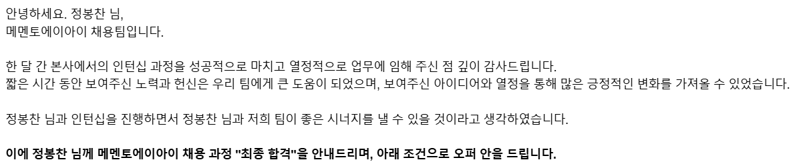

## 과정

사실 메멘토에이아이는 프론트엔드 신입 정규직으로 지원했다가 서류 탈락 했던 곳이다.

코드잇 부트캠프 수료 후 8명이 모인 [사기집단](https://github.com/fraudgroup) 취업 준비 스터디에서 도움을 주시는 승완님께서 메멘토에이아이 인턴 공고를 공유해 주셨고 바로 지원했다.

절차는 *서류* -> *코딩 테스트* -> *면접* 순서고 나는 지원하고 바로 다음 날 화상 면접부터 진행됐다.

면접을 먼저 봐서 코딩 테스트를 부전승으로 넘어갔나 싶었지만 아쉽게도 이후에 코딩 테스트도 보게 되었다. 다행히 코딩 테스트의 난이도는 엄청 쉬웠다. 하지만 너무 쉬웠기 때문에 최종 합격 후에도 "여길 믿고 1개월 인턴을 진행해도 될까?"하는 걱정이 많이 됐었다.

그럼에도 실무 경험을 해볼 수 있다는 건 값진 기회라고 생각했기 때문에 많은 기대를 품고 인턴을 시작했다.

그리고 무려 **채용 연계형 인턴**이다.

## 입사

인턴 총 30명을 뽑았고 15명은 1기, 나머지 15명은 2기로 2주 후에 입사 예정이었다.

나는 1기로 *2024.10.07* ~ *2024.11.06* 까지 메멘토에이아이 프론트엔드 인턴으로 근무하게 되었다. 1기는 프론트엔드 9명, 백엔드 6명 구성이다.

살면서 출입증 찍고 들어갈 수 있는 회사에 가보는 것이 소원이었는데 벌써 소원을 이루었다.

첫날에는 주문한 장비가 도착하지 않아서 회의실에서 대기를 많이 했고 대표님의 간단한 회사 소개와 팀 배정이 진행됐다.

인턴 과정 업무는 인사 시스템, 제품 발주 시스템을 처음부터 만드는 것이다.

인사 시스템에는 12명, 제품 발주 시스템에는 3명이 편성 되었고 나는 제품 발주 시스템 프론트엔드로 배정됐다.

기존에 사용하던 레거시 시스템이 있지만 많은 문제가 있었고 이번 프로젝트를 실사용 목적 만드는데 놀랍게도 회사의 개발 문화, 컨벤션 등을 알려주지 않고 사용해야 할 언어, 프레임워크만 알려주고 나머지 라이브러리 선정부터 컨벤션까지 인턴들이 직접 정해서 진행해야 했다.

심지어 기획까지 해야 하는 경우도 있어서 인턴 중에서 기획자도 선발했다.

## 실무 프로젝트 투입

제품 발주 시스템을 개발한 지 일주일 정도 됐나 인턴 중에서 프론트엔드 2명, 백엔드 2명이 선발돼서 실무 프로젝트에 투입됐다.

우리 팀은 3명인데 내가 실무에 투입돼서 걱정이 많았지만 처음에는 실무 할당이 적어서 동시에 진행했다.

처음 접하는 실무 코드는 빛나 보였다.

## QA 진행

실무 프로젝트에 투입된 지 얼마 지나지 않아서 나머지 15명 인턴 2기 분들이 오셨고 1기 인턴들의 대부분은 실무에 투입되고 QA를 진행했다.

엑셀 시트에 QA 사항들을 적었고, QA 마무리 후에는 인턴들이 엑셀 보면서 해결할 수 있는 부분들을 찾아서 해결하면 됐다.

## 2차 실무 프로젝트 투입

인턴 종료까지 주말 포함 5일 남은 상황에서 QA 해결 중에 갑자기 프론트엔드 2명, 백엔드 2명이 선발돼서 11월 개발 일정에 투입됐다.

나는 다음과 같은 업무를 맡게 되었다.

- 웹(React): **내 정보 페이지**, **비밀번호 변경**, **첫 로그인 시 비밀번호 변경 안내**
- 앱(React Native): **서명 미완료 안내 토스트**, **동의서 이메일 재발송**

다행히 인턴 종료 하루 남기고 모든 PR이 승인돼서 성공적으로 머지되었다.

## 종료

인턴 마지막 날에는 업무 마무리 진행과 노트북 초기화, 장비 반납이 진행됐고 사은품으로 라미 볼펜도 받게 됐다. 근처 코엑스에 가서 동봉된 쿠폰을 보여주면 각인도 할 수 있었다.

인턴 대부분이 매일 야근 했고 주말에 출근하기도 했다. 심지어 오늘 출근했는데 내일 퇴근하는 인턴분도 꽤 계셨다.

회사에서 원하는 인재상은 워라밸을 중요시하는 사람보다 성과와 그 성과에 대한 충분한 보상을 받기를 원하는 사람이다.

나는 사실 워라밸을 중요시한다. 인턴으로 근무하는 과정까지도 그랬다. 특히 야근은 정말 싫어하고 하지 않는다. 그럼에도 이번 인턴 과정은 매일 야근했고 주말에도 출근해서 일하고 공부했다. 적어도 1~2년 차까지는 어떻게든 버티자는 생각이었다.

처음에는 이런 환경이 정말 싫었고 정규직이 된다고 하더라도 나는 고민이 많이 될 거 같다고 생각했었는데 신기하게도 정말 재밌게 했다. 정규직이 되고 싶어서 한 것도 아니고 내 개인적으로 욕심이 많이 났다. 계속 성장하는 사람이 되고 싶었고 개발하는 과정 자체가 정말 즐거웠다.

메멘토에이아이가 의료 도메인 회사, 금융 도메인 회사가 합쳐진 곳인데 퇴근하기 직전에 금융 도메인 백엔드 리더분께서 인턴 프론트엔드 1명, 백엔드 4명을 따로 부르셔서 이야기 나눴다.

처음에는 마지막 퇴근 직전에 부르셔서 이 인원들이 정규직 전환되나 생각하면서 갔는데 평가에는 따로 반영되지 않는다고 하셨다. 그냥 리더분께서 궁금하셨다고 한다.

평소 관심 있는 도메인과 의료, 금융 중에서는 어떤 도메인에 더 관심 있는지 편하게 이야기했다.

## 정규직 전환

나는 정규직 전환에 대한 확신도 없었고 처음에는 워라밸을 중요하게 생각했기에 인턴 중에도 꾸준히 입사 지원을 해서 다른 곳에 최종 합격했고 입사 결정만 남겨둔 상황이었다.

그럼에도 인턴을 진행하면서 내가 생각보다 워라밸은 크게 신경 쓰지 않는다는 것을 느꼈고 재밌게 일할 수 있는 곳, 성장할 수 있는 곳을 원해서 메멘토에이아이 정규직이 되면 좋겠다고 생각했다.

최종적으로 프론트엔드 9명, 백엔드 6명 중에서 정규직 전환은 4명 됐다.

프론트엔드 1명, 백엔드 1명, 기획자 2명

감사하게도 프론트엔드 정규직 전환이 됐고 최종 합격한 다른 곳은 입사 포기를 결정했다.

## 앞으로

*2024.11.18* 처음 출근한다.

정규직 전환이 됐어도 수습 기간 3개월이 남아있다.

이 과정까지 잘 마무리해서 프론트엔드 개발자를 이어가고 싶다.

